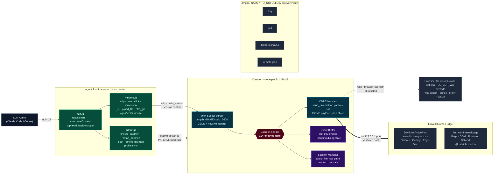
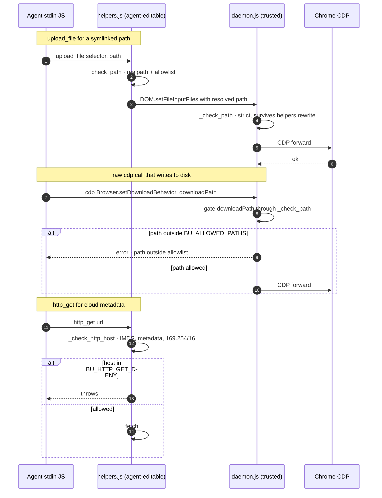

# Architecture

The harness is a thin bridge between an LLM agent's stdout and a real Chrome's CDP socket, with a small daemon holding the WebSocket so stdin can be cheap.

For the richly styled standalone view, open [`architecture.html`](architecture.html). This doc is the GitHub-viewable summary and is kept in sync with the code.

## The 30-second model

- An LLM agent emits JS on stdin.
- `run.js` wraps it in an async IIFE and runs it in a `vm` context with every export from `helpers.js` + `admin.js` pre-injected as globals.
- Helpers send one JSON-per-line over a Unix socket at `/tmp/bu-<BU_NAME>.sock` to a long-running `daemon.js`.
- The daemon holds a single CDP WebSocket — to the user's Chrome (auto-discovered via `DevToolsActivePort`) or, optionally, to a Browser Use cloud browser (`BU_CDP_WS` override, validated against an allowlist).
- Before forwarding, the daemon intercepts a small set of CDP methods and enforces a filesystem allowlist (`BU_ALLOWED_PATHS`).

## Components and data flow

## Security gates (request trace)

The harness is **not** a sandbox — it runs with full Node privileges. What it *does* enforce is that three specific data paths (filesystem reads, filesystem writes, network egress) pass through a small number of gates before reaching the browser or the OS. The daemon is the trusted layer; `helpers.js` checks are defence-in-depth because the agent can rewrite `helpers.js`.

## Wire protocol

One JSON object per line on `/tmp/bu-<NAME>.sock`.

- **Requests** — `{method, params, session_id}` for raw CDP, or `{meta: 'drain_events' | 'session' | 'set_session' | 'pending_dialog' | 'shutdown'}` for daemon control.
- **Responses** — `{result}` / `{error}` / `{events}` / `{session_id}` / `{dialog}`.
- `params.session_id`, if present on the client side, is stripped by `cdp()` and sent as the top-level `session_id` field.
- `Target.*` calls bypass session routing and go to the browser context.

## BU_NAME namespacing

Every `/tmp/bu-*` file is keyed on `BU_NAME` (default `"default"`). Parallel agents MUST use distinct names to avoid fighting over the same daemon, socket, and Chrome attachment. `BU_NAME=work` and `BU_NAME=personal` yield two fully independent daemons with their own event buffers, sessions, logs, and — if configured — their own cloud browsers.

## Key environment variables

| Var | Default | Role |
|---|---|---|
| `BU_NAME` | `default` | Namespaces all sidecar files; picks which daemon to talk to |
| `BU_CDP_WS` | (auto-discover Chrome) | Override target WebSocket; validated against `ws://127.0.0.1`, `wss://*.browser-use.com`, or `BU_CDP_WS_ALLOW_HOSTS` |
| `BU_ALLOWED_PATHS` | `/tmp:$cwd` | Colon-separated filesystem allowlist for `upload_file`, `screenshot`, and daemon-gated CDP download paths. Pinned at daemon spawn time |
| `BU_HTTP_GET_DENY` | `169.254.169.254,metadata.google.internal,metadata` | Hostname deny list for `http_get`; also auto-blocks `169.254.0.0/16` |
| `BU_BROWSER_ID` + `BROWSER_USE_API_KEY` | (none) | Lets the daemon `PATCH` the cloud browser to `stop` on clean shutdown |

## What the diagram doesn't show

- **Self-healing.** When a helper is missing, the agent edits `helpers.js` mid-task and the next invocation picks it up via the global `npm install -g .` symlink — no reinstall. The daemon hashes `helpers.js` and logs SHA diffs to `/tmp/bu-<NAME>.log` as an audit trail (`_audit_helpers`).
- **Domain / interaction skills.** `goto(url)` auto-lists `.md` files under `domain-skills/<host-key>/` in its return value so the next agent on the same site reads the learnings before retrying.
- **Cold-start flow.** First attach may require a user to tick the remote-debugging checkbox in `chrome://inspect/#remote-debugging`; subsequent launches are automatic because the setting is per-profile-sticky. Full cold-start decision tree in [`install.md`](install.md).

For the deeper "why" behind each constraint — raw `ws` only, no manager layer, Python-parity preserved — see [`CLAUDE.md`](CLAUDE.md) § "Design constraints".
